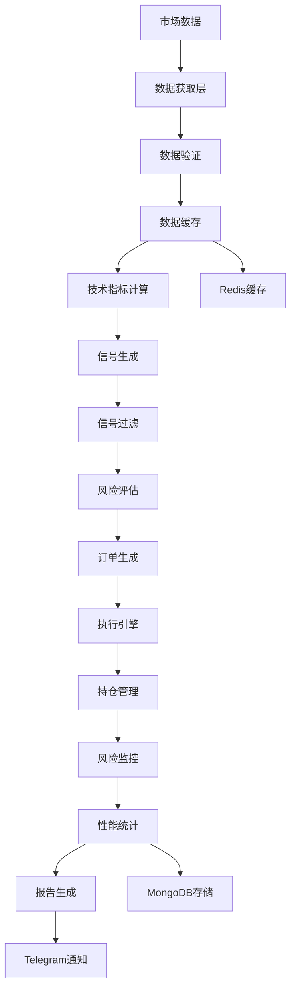

# 🏗️ 架构设计文档

## 📋 目录

- [系统概述](#系统概述)
- [整体架构](#整体架构)
- [核心模块设计](#核心模块设计)
- [数据流设计](#数据流设计)
- [异步架构](#异步架构)
- [存储架构](#存储架构)
- [安全架构](#安全架构)
- [可扩展性设计](#可扩展性设计)
- [性能优化](#性能优化)
- [部署架构](#部署架构)

## 📖 系统概述

### 设计原则

1. **高性能**: 异步并发处理，毫秒级响应
2. **高可用**: 多数据源备份，容错设计
3. **可扩展**: 模块化架构，插件系统
4. **安全性**: 多层安全防护，数据加密
5. **易维护**: 清晰的代码结构，完善的日志

### 技术栈

- **核心语言**: Python 3.8+
- **异步框架**: asyncio, aiohttp
- **数据处理**: NumPy, Pandas, SciPy
- **机器学习**: LightGBM, XGBoost
- **数据库**: Redis, MongoDB
- **监控**: Prometheus, Grafana
- **通知**: Telegram Bot API

## 🎯 整体架构

```
┌─────────────────────────────────────────────────────────────────┐
│                        Web Interface                            │
├─────────────────────────────────────────────────────────────────┤
│                     Trading Engine                              │
├─────────────────────────────────────────────────────────────────┤
│  ┌─────────────┐  ┌─────────────┐  ┌─────────────┐  ┌─────────┐ │
│  │   Signal    │  │   Pattern   │  │    Risk     │  │ Order   │ │
│  │ Generator   │  │  Detector   │  │  Manager    │  │Executor │ │
│  └─────────────┘  └─────────────┘  └─────────────┘  └─────────┘ │
├─────────────────────────────────────────────────────────────────┤
│  ┌─────────────┐  ┌─────────────┐  ┌─────────────┐  ┌─────────┐ │
│  │    Data     │  │ Technical   │  │ Resource    │  │ Config  │ │
│  │  Fetcher    │  │ Indicators  │  │ Monitor     │  │Manager  │ │
│  └─────────────┘  └─────────────┘  └─────────────┘  └─────────┘ │
├─────────────────────────────────────────────────────────────────┤
│                      Storage Layer                              │
│  ┌─────────────┐  ┌─────────────┐  ┌─────────────┐              │
│  │    Redis    │  │  MongoDB    │  │  File Log   │              │
│  │   Cache     │  │ Database    │  │   System    │              │
│  └─────────────┘  └─────────────┘  └─────────────┘              │
├─────────────────────────────────────────────────────────────────┤
│                     External APIs                               │
│  ┌─────────────┐  ┌─────────────┐  ┌─────────────┐              │
│  │  Binance    │  │ CoinGecko   │  │ Telegram    │              │
│  │    API      │  │    API      │  │    Bot      │              │
│  └─────────────┘  └─────────────┘  └─────────────┘              │
└─────────────────────────────────────────────────────────────────┘
```

### 架构特点

- **分层架构**: 表现层、业务层、数据层清晰分离
- **微服务设计**: 每个模块独立可测试
- **事件驱动**: 基于事件的松耦合通信
- **插件系统**: 支持功能扩展
- **监控集成**: 全链路监控和告警

## 🧠 核心模块设计

### 1. 信号生成模块

```python
# 核心组件架构
class SignalGenerator:
    def __init__(self):
        self.macd_detector = MACDDivergenceDetector()
        self.pattern_detector = EnhancedPatternDetector()
        self.technical_analyzer = TechnicalAnalyzer()
        self.signal_filter = SignalFilter()
    
    async def generate_signal(self, market_data):
        # 多维度信号生成
        macd_signal = await self.macd_detector.detect(market_data)
        pattern_signal = await self.pattern_detector.detect(market_data)
        technical_signal = await self.technical_analyzer.analyze(market_data)
        
        # 信号融合
        composite_signal = self.signal_filter.combine_signals(
            [macd_signal, pattern_signal, technical_signal]
        )
        
        return composite_signal
```

**设计亮点**:
- 多策略融合：MACD背离 + 形态识别 + 技术指标
- 信号过滤：基于置信度和强度的多重过滤
- 实时更新：支持实时市场数据处理

### 2. 模式检测模块

```python
# 增强形态检测器
class EnhancedPatternDetector:
    def __init__(self):
        self.macd_detector = MACDMorphDetector()
        self.pattern_recognizer = PatternRecognizer()
        self.signal_validator = SignalValidator()
    
    async def detect_patterns(self, price_data):
        # 并行检测多种形态
        tasks = [
            self.detect_divergence(price_data),
            self.detect_engulfing(price_data),
            self.detect_head_shoulder(price_data),
            self.detect_triangle(price_data)
        ]
        
        results = await asyncio.gather(*tasks)
        return self.combine_patterns(results)
```

**核心特性**:
- 专家算法：基于10年经验的优化算法
- 连续验证：支持2-3个连续信号验证
- 噪音过滤：prominence和标准差过滤

### 3. 风险管理模块

```python
# 多层风险管理
class RiskManager:
    def __init__(self):
        self.position_manager = PositionManager()
        self.var_calculator = VarCalculator()
        self.time_risk_manager = TimeBasedRiskManager()
        self.resource_monitor = ResourceMonitor()
    
    async def assess_risk(self, trade_signal):
        # 多维度风险评估
        position_risk = self.position_manager.calculate_risk(trade_signal)
        market_risk = self.var_calculator.calculate_var(trade_signal)
        time_risk = self.time_risk_manager.check_time_limits(trade_signal)
        system_risk = await self.resource_monitor.check_resources()
        
        return self.combine_risk_assessment([
            position_risk, market_risk, time_risk, system_risk
        ])
```

**风险控制层次**:
1. **交易前检查**：仓位、杠杆、VaR限制
2. **交易中监控**：实时风险监控、动态调整
3. **紧急响应**：熔断机制、强制平仓

### 4. 数据获取模块

```python
# 高可用数据获取
class AdvancedDataFetcher:
    def __init__(self):
        self.primary_client = BinanceClient()
        self.backup_clients = [CoinGeckoClient(), AlternativeClient()]
        self.cache_manager = CacheManager()
        self.rate_limiter = RateLimiter()
    
    async def fetch_data(self, symbol, interval):
        # 主数据源获取
        try:
            data = await self.primary_client.get_klines(symbol, interval)
            if self.validate_data(data):
                await self.cache_manager.store(symbol, data)
                return data
        except Exception as e:
            logger.warning(f"主数据源失败: {e}")
        
        # 备用数据源
        for backup_client in self.backup_clients:
            try:
                data = await backup_client.get_klines(symbol, interval)
                if self.validate_data(data):
                    return data
            except Exception as e:
                logger.warning(f"备用数据源失败: {e}")
        
        # 缓存降级
        return await self.cache_manager.get_cached(symbol)
```

**数据架构特点**:
- 多源冗余：主数据源 + 多个备用数据源
- 智能缓存：多级缓存策略
- 数据验证：完整性和准确性检查

## 🔄 数据流设计

### 数据流图



### 数据流说明

1. **数据获取**: 从多个API源获取实时和历史数据
2. **数据处理**: 清洗、验证、标准化处理
3. **指标计算**: 并行计算多种技术指标
4. **信号生成**: 多策略融合生成交易信号
5. **风险控制**: 多层次风险评估和控制
6. **订单执行**: 智能订单路由和执行
7. **监控反馈**: 实时监控和性能反馈

## ⚡ 异步架构

### 异步处理模型

```python
# 主异步循环
class TradingEngine:
    def __init__(self):
        self.loop = asyncio.new_event_loop()
        asyncio.set_event_loop(self.loop)
        
    async def start(self):
        # 启动核心任务
        tasks = [
            self.data_collection_loop(),
            self.signal_generation_loop(),
            self.risk_monitoring_loop(),
            self.order_execution_loop(),
            self.performance_monitoring_loop()
        ]
        
        await asyncio.gather(*tasks)
    
    async def data_collection_loop(self):
        """数据收集循环"""
        while self.running:
            try:
                # 并行获取多个品种数据
                symbols = self.get_active_symbols()
                tasks = [self.fetch_symbol_data(symbol) for symbol in symbols]
                results = await asyncio.gather(*tasks, return_exceptions=True)
                
                # 处理结果
                await self.process_data_results(results)
                
            except Exception as e:
                logger.error(f"数据收集循环错误: {e}")
            
            await asyncio.sleep(self.data_interval)
```

### 并发控制

```python
# 并发控制和资源管理
class ConcurrencyManager:
    def __init__(self):
        self.data_semaphore = asyncio.Semaphore(10)  # 数据获取并发限制
        self.signal_semaphore = asyncio.Semaphore(5)  # 信号生成并发限制
        self.order_semaphore = asyncio.Semaphore(3)   # 订单执行并发限制
        
    async def fetch_data_with_limit(self, symbol):
        async with self.data_semaphore:
            return await self.data_fetcher.fetch(symbol)
    
    async def generate_signal_with_limit(self, data):
        async with self.signal_semaphore:
            return await self.signal_generator.generate(data)
```

**异步优化策略**:
- 分层并发控制：不同层级的并发限制
- 资源池管理：连接池、对象池复用
- 背压处理：队列满时的流控机制

## 💾 存储架构

### 多层存储设计

```python
# 存储层架构
class StorageManager:
    def __init__(self):
        self.redis_client = RedisClient()      # L1缓存
        self.mongodb_client = MongoClient()    # 持久化存储
        self.file_logger = FileLogger()       # 日志存储
        
    async def store_market_data(self, symbol, data):
        # 多层存储策略
        await asyncio.gather(
            self.redis_client.set(f"market:{symbol}", data, ex=300),  # 5分钟缓存
            self.mongodb_client.insert("market_data", data),          # 永久存储
            self.file_logger.log_data(symbol, data)                  # 日志记录
        )
    
    async def get_market_data(self, symbol):
        # 多层读取策略
        # 1. 先从Redis缓存读取
        cached_data = await self.redis_client.get(f"market:{symbol}")
        if cached_data:
            return cached_data
        
        # 2. 从MongoDB读取
        db_data = await self.mongodb_client.find_one("market_data", {"symbol": symbol})
        if db_data:
            # 回写到缓存
            await self.redis_client.set(f"market:{symbol}", db_data, ex=300)
            return db_data
        
        return None
```

### 数据模型设计

```python
# MongoDB数据模型
class DataModels:
    market_data = {
        "symbol": str,
        "timestamp": datetime,
        "open": float,
        "high": float,
        "low": float,
        "close": float,
        "volume": float,
        "indicators": dict,
        "created_at": datetime,
        "ttl": datetime  # 数据过期时间
    }
    
    trading_signals = {
        "id": str,
        "symbol": str,
        "signal_type": str,
        "confidence": float,
        "entry_price": float,
        "stop_loss": float,
        "take_profit": float,
        "timestamp": datetime,
        "metadata": dict,
        "status": str
    }
    
    risk_metrics = {
        "timestamp": datetime,
        "current_drawdown": float,
        "max_drawdown": float,
        "var_95": float,
        "var_99": float,
        "positions": list,
        "total_exposure": float
    }
```

## 🔒 安全架构

### 多层安全防护

```python
# 安全管理器
class SecurityManager:
    def __init__(self):
        self.encryption_key = self.load_encryption_key()
        self.api_keys = self.load_encrypted_api_keys()
        self.rate_limiter = RateLimiter()
        self.audit_logger = AuditLogger()
        
    def encrypt_sensitive_data(self, data):
        """敏感数据加密"""
        cipher = Fernet(self.encryption_key)
        return cipher.encrypt(data.encode())
    
    def decrypt_sensitive_data(self, encrypted_data):
        """敏感数据解密"""
        cipher = Fernet(self.encryption_key)
        return cipher.decrypt(encrypted_data).decode()
    
    async def secure_api_call(self, endpoint, params):
        """安全API调用"""
        # 速率限制
        await self.rate_limiter.acquire()
        
        # 签名验证
        signature = self.generate_signature(params)
        headers = {"X-Signature": signature}
        
        # 记录审计日志
        await self.audit_logger.log_api_call(endpoint, params)
        
        return await self.make_api_call(endpoint, params, headers)
```

### 安全策略

1. **API密钥管理**:
   - 环境变量存储
   - 定期轮换
   - 权限最小化

2. **数据加密**:
   - 传输加密（TLS）
   - 存储加密（AES）
   - 密钥管理（HSM）

3. **访问控制**:
   - 基于角色的访问控制
   - API速率限制
   - 审计日志记录

## 🚀 可扩展性设计

### 插件系统

```python
# 插件架构
class PluginManager:
    def __init__(self):
        self.plugins = {}
        self.hooks = defaultdict(list)
        
    def register_plugin(self, plugin):
        """注册插件"""
        self.plugins[plugin.name] = plugin
        
        # 注册钩子
        for hook_name in plugin.hooks:
            self.hooks[hook_name].append(plugin)
    
    async def execute_hook(self, hook_name, *args, **kwargs):
        """执行钩子"""
        results = []
        for plugin in self.hooks[hook_name]:
            try:
                result = await plugin.execute_hook(hook_name, *args, **kwargs)
                results.append(result)
            except Exception as e:
                logger.error(f"插件 {plugin.name} 执行失败: {e}")
        
        return results

# 插件基类
class BasePlugin:
    def __init__(self, name):
        self.name = name
        self.hooks = []
        
    async def execute_hook(self, hook_name, *args, **kwargs):
        """执行钩子方法"""
        method = getattr(self, f"on_{hook_name}", None)
        if method:
            return await method(*args, **kwargs)
```

### 水平扩展支持

```python
# 分布式架构支持
class DistributedManager:
    def __init__(self):
        self.redis_cluster = RedisCluster()
        self.message_queue = MessageQueue()
        self.load_balancer = LoadBalancer()
        
    async def distribute_workload(self, tasks):
        """分发工作负载"""
        # 任务分片
        task_chunks = self.chunk_tasks(tasks)
        
        # 分发到不同节点
        results = []
        for chunk in task_chunks:
            node = self.load_balancer.get_available_node()
            result = await self.execute_on_node(node, chunk)
            results.append(result)
        
        return self.merge_results(results)
```

## 📊 性能优化

### 缓存策略

```python
# 多级缓存系统
class CacheManager:
    def __init__(self):
        self.l1_cache = {}  # 内存缓存
        self.l2_cache = RedisClient()  # Redis缓存
        self.cache_stats = CacheStats()
        
    async def get(self, key):
        # L1缓存
        if key in self.l1_cache:
            self.cache_stats.l1_hits += 1
            return self.l1_cache[key]
        
        # L2缓存
        value = await self.l2_cache.get(key)
        if value:
            self.cache_stats.l2_hits += 1
            # 回写到L1
            self.l1_cache[key] = value
            return value
        
        self.cache_stats.misses += 1
        return None
    
    async def set(self, key, value, ttl=300):
        # 同时写入L1和L2缓存
        self.l1_cache[key] = value
        await self.l2_cache.set(key, value, ex=ttl)
```

### 性能监控

```python
# 性能监控系统
class PerformanceMonitor:
    def __init__(self):
        self.metrics = defaultdict(list)
        self.alerts = []
        
    def record_execution_time(self, func_name, execution_time):
        """记录执行时间"""
        self.metrics[f"{func_name}_time"].append(execution_time)
        
        # 检查性能阈值
        if execution_time > self.get_threshold(func_name):
            alert = PerformanceAlert(
                function=func_name,
                execution_time=execution_time,
                threshold=self.get_threshold(func_name)
            )
            self.alerts.append(alert)
    
    def get_performance_summary(self):
        """获取性能摘要"""
        summary = {}
        for metric_name, values in self.metrics.items():
            summary[metric_name] = {
                "avg": sum(values) / len(values),
                "max": max(values),
                "min": min(values),
                "count": len(values)
            }
        return summary
```

## 🏗️ 部署架构

### 容器化部署

```dockerfile
# Dockerfile
FROM python:3.10-slim

WORKDIR /app

# 安装依赖
COPY requirements.txt .
RUN pip install -r requirements.txt

# 复制应用代码
COPY . .

# 健康检查
HEALTHCHECK --interval=30s --timeout=10s --start-period=5s --retries=3 \
  CMD python scripts/health_check.py

# 启动应用
CMD ["python", "main.py"]
```

### Docker Compose配置

```yaml
# docker-compose.yml
version: '3.8'

services:
  trading-system:
    build: .
    ports:
      - "8080:8080"
    depends_on:
      - redis
      - mongodb
    environment:
      - REDIS_URL=redis://redis:6379
      - MONGODB_URL=mongodb://mongodb:27017
    volumes:
      - ./logs:/app/logs
      - ./config:/app/config
    restart: unless-stopped

  redis:
    image: redis:7-alpine
    ports:
      - "6379:6379"
    volumes:
      - redis_data:/data
    restart: unless-stopped

  mongodb:
    image: mongo:5
    ports:
      - "27017:27017"
    volumes:
      - mongodb_data:/data/db
    restart: unless-stopped

  prometheus:
    image: prom/prometheus
    ports:
      - "9090:9090"
    volumes:
      - ./monitoring/prometheus.yml:/etc/prometheus/prometheus.yml
    restart: unless-stopped

  grafana:
    image: grafana/grafana
    ports:
      - "3000:3000"
    volumes:
      - grafana_data:/var/lib/grafana
    restart: unless-stopped

volumes:
  redis_data:
  mongodb_data:
  grafana_data:
```

### 生产环境部署

```yaml
# kubernetes/deployment.yaml
apiVersion: apps/v1
kind: Deployment
metadata:
  name: trading-system
spec:
  replicas: 3
  selector:
    matchLabels:
      app: trading-system
  template:
    metadata:
      labels:
        app: trading-system
    spec:
      containers:
      - name: trading-system
        image: trading-system:latest
        ports:
        - containerPort: 8080
        env:
        - name: REDIS_URL
          valueFrom:
            configMapKeyRef:
              name: app-config
              key: redis-url
        - name: MONGODB_URL
          valueFrom:
            secretKeyRef:
              name: app-secrets
              key: mongodb-url
        resources:
          requests:
            memory: "512Mi"
            cpu: "500m"
          limits:
            memory: "1Gi"
            cpu: "1000m"
        livenessProbe:
          httpGet:
            path: /health
            port: 8080
          initialDelaySeconds: 30
          periodSeconds: 10
        readinessProbe:
          httpGet:
            path: /ready
            port: 8080
          initialDelaySeconds: 5
          periodSeconds: 5
```

## 📈 监控和运维

### 监控架构

```python
# 监控系统集成
class MonitoringSystem:
    def __init__(self):
        self.prometheus_client = PrometheusClient()
        self.grafana_client = GrafanaClient()
        self.alert_manager = AlertManager()
        
    def record_metric(self, metric_name, value, labels=None):
        """记录指标"""
        self.prometheus_client.counter(metric_name).labels(**(labels or {})).inc(value)
    
    def create_alert(self, alert_name, condition, severity="warning"):
        """创建告警规则"""
        alert_rule = {
            "alert": alert_name,
            "expr": condition,
            "labels": {"severity": severity},
            "annotations": {
                "summary": f"Alert: {alert_name}",
                "description": f"Condition: {condition}"
            }
        }
        self.alert_manager.add_rule(alert_rule)
```

### 运维工具

```bash
# 运维脚本
#!/bin/bash
# scripts/deploy.sh

# 健康检查
health_check() {
    curl -f http://localhost:8080/health || exit 1
}

# 滚动更新
rolling_update() {
    kubectl set image deployment/trading-system trading-system=trading-system:$1
    kubectl rollout status deployment/trading-system
}

# 性能监控
performance_monitor() {
    kubectl top pods -l app=trading-system
    kubectl logs -f -l app=trading-system --tail=100
}

# 备份数据
backup_data() {
    kubectl exec -it mongodb-0 -- mongodump --out /tmp/backup
    kubectl cp mongodb-0:/tmp/backup ./backup-$(date +%Y%m%d)
}
```

## 🔗 相关文档

- [用户使用指南](USER_GUIDE.md)
- [API参考文档](API_REFERENCE.md)
- [配置参数说明](CONFIGURATION.md)
- [故障排除指南](TROUBLESHOOTING.md)

---

🏗️ **架构说明**: 本架构基于微服务和事件驱动设计，支持高并发、高可用和水平扩展。 