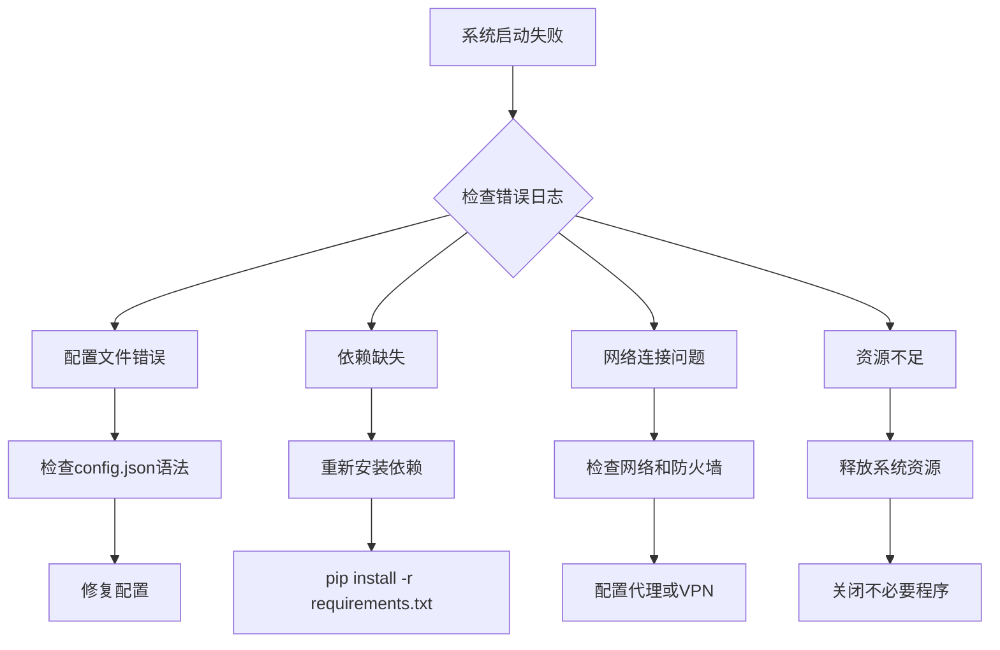

# 🔧 故障排除指南

## 📋 目录

- [快速诊断](#快速诊断)
- [常见问题](#常见问题)
- [系统问题](#系统问题)
- [配置问题](#配置问题)
- [数据问题](#数据问题)
- [性能问题](#性能问题)
- [网络问题](#网络问题)
- [调试工具](#调试工具)
- [日志分析](#日志分析)
- [紧急处理](#紧急处理)

## 🚨 快速诊断

### 系统健康检查

```bash
# 快速系统检查脚本
#!/bin/bash

echo "🔍 系统健康检查..."

# 检查Python环境
python --version
echo "✅ Python版本检查完成"

# 检查依赖安装
python -c "import numpy, pandas, scipy, redis, pymongo" 2>/dev/null && echo "✅ 核心依赖正常" || echo "❌ 依赖缺失"

# 检查配置文件
test -f config/config.json && echo "✅ 配置文件存在" || echo "❌ 配置文件缺失"

# 检查数据库连接
redis-cli ping 2>/dev/null && echo "✅ Redis连接正常" || echo "❌ Redis连接失败"

# 检查API连接
curl -s "https://api.binance.com/api/v3/ping" >/dev/null && echo "✅ Binance API正常" || echo "❌ Binance API异常"

# 检查系统资源
echo "💻 系统资源状态:"
free -h
df -h
```

### 故障诊断流程



## ❓ 常见问题

### Q1: 系统启动失败

**错误信息**: `ModuleNotFoundError: No module named 'xxx'`

**解决方案**:
```bash
# 1. 检查虚拟环境
source venv/bin/activate

# 2. 重新安装依赖
pip install -r requirements.txt

# 3. 检查Python路径
python -c "import sys; print(sys.path)"

# 4. 手动安装缺失模块
pip install xxx
```

### Q2: API连接超时

**错误信息**: `ConnectionError: HTTPSConnectionPool`

**解决方案**:
```python
# 1. 检查网络连接
import requests
try:
    response = requests.get("https://api.binance.com/api/v3/ping", timeout=5)
    print("网络连接正常")
except requests.exceptions.Timeout:
    print("网络连接超时")
except requests.exceptions.ConnectionError:
    print("无法连接到服务器")

# 2. 配置代理
proxies = {
    'http': 'http://proxy.example.com:8080',
    'https': 'http://proxy.example.com:8080'
}

# 3. 增加超时时间
config.json中修改：
{
    "api": {
        "binance": {
            "timeout": 60
        }
    }
}
```

### Q3: 内存使用过高

**错误信息**: `MemoryError` 或系统卡顿

**解决方案**:
```bash
# 1. 检查内存使用
free -h
top -p $(pgrep -f python)

# 2. 限制数据量
config.json中修改：
{
    "trading": {
        "lookback_period": 50,  # 减少回看周期
        "max_positions": 2      # 减少最大持仓数
    }
}

# 3. 启用内存限制
python -c "import resource; resource.setrlimit(resource.RLIMIT_AS, (2*1024*1024*1024, -1))"
```

### Q4: 数据同步问题

**错误信息**: `Data validation failed` 或数据不一致

**解决方案**:
```python
# 1. 清理缓存
redis-cli FLUSHALL

# 2. 重置数据库
python scripts/reset_database.py

# 3. 强制重新获取数据
python scripts/refresh_data.py --symbol BTCUSDT --force

# 4. 检查数据质量
python scripts/validate_data.py
```

## 🖥️ 系统问题

### 启动问题

#### 问题：Python版本不兼容
```bash
# 错误信息
SyntaxError: invalid syntax (f-string)

# 解决方案
# 1. 检查Python版本
python --version  # 需要3.8+

# 2. 升级Python
# Ubuntu/Debian
sudo apt update
sudo apt install python3.10

# macOS
brew install python@3.10

# 3. 创建新虚拟环境
python3.10 -m venv venv
source venv/bin/activate
```

#### 问题：权限错误
```bash
# 错误信息
PermissionError: [Errno 13] Permission denied: 'logs/trading_system.log'

# 解决方案
# 1. 创建日志目录
mkdir -p logs
chmod 755 logs

# 2. 修改文件权限
sudo chown -R $USER:$USER logs/
chmod 644 logs/*.log

# 3. 使用相对路径
config.json中修改：
{
    "logging": {
        "file": "./logs/trading_system.log"
    }
}
```

### 性能问题

#### 问题：CPU使用率过高
```bash
# 诊断步骤
# 1. 查看进程状态
htop
ps aux | grep python

# 2. Python性能分析
python -m cProfile -o profile.stats main.py

# 3. 分析性能瓶颈
python -c "
import pstats
p = pstats.Stats('profile.stats')
p.sort_stats('cumulative').print_stats(20)
"

# 优化方案
# 1. 减少计算频率
config.json中修改：
{
    "system": {
        "resource_monitoring": {
            "check_interval": 60  # 增加检查间隔
        }
    }
}

# 2. 启用缓存
{
    "api": {
        "cache_enabled": true,
        "cache_ttl": 300
    }
}
```

#### 问题：内存泄漏
```python
# 内存监控脚本
import psutil
import gc
import tracemalloc

def monitor_memory():
    # 启用内存追踪
    tracemalloc.start()
    
    process = psutil.Process()
    
    while True:
        # 获取内存使用
        memory_info = process.memory_info()
        memory_percent = process.memory_percent()
        
        print(f"内存使用: {memory_info.rss / 1024 / 1024:.2f} MB ({memory_percent:.1f}%)")
        
        # 获取内存快照
        snapshot = tracemalloc.take_snapshot()
        top_stats = snapshot.statistics('lineno')
        
        print("Top 10 内存使用:")
        for stat in top_stats[:10]:
            print(stat)
        
        # 强制垃圾回收
        gc.collect()
        
        time.sleep(60)

# 内存优化建议
# 1. 定期清理缓存
def cleanup_cache():
    import gc
    gc.collect()
    
    # 清理Redis缓存
    redis_client.flushdb()
    
    # 清理内存缓存
    cache_manager.clear_all()

# 2. 限制数据量
def limit_data_size():
    # 限制K线数据量
    MAX_KLINES = 1000
    
    # 限制信号历史
    MAX_SIGNALS = 500
    
    # 定期清理历史数据
    cleanup_old_data()
```

## ⚙️ 配置问题

### 配置文件错误

#### 问题：JSON语法错误
```bash
# 错误信息
JSONDecodeError: Expecting ',' delimiter: line 15 column 5

# 解决方案
# 1. 验证JSON格式
python -c "
import json
with open('config/config.json', 'r') as f:
    json.load(f)
print('JSON格式正确')
"

# 2. 使用JSON格式化工具
pip install jsonschema
python scripts/validate_config.py

# 3. 在线JSON验证
# https://jsonlint.com/
```

#### 问题：配置参数无效
```python
# 配置验证脚本
def validate_config():
    import json
    from jsonschema import validate
    
    # 配置schema
    schema = {
        "type": "object",
        "properties": {
            "trading": {
                "type": "object",
                "properties": {
                    "risk_per_trade": {
                        "type": "number",
                        "minimum": 0.001,
                        "maximum": 0.1
                    },
                    "max_leverage": {
                        "type": "number",
                        "minimum": 1,
                        "maximum": 100
                    }
                },
                "required": ["risk_per_trade", "max_leverage"]
            }
        },
        "required": ["trading"]
    }
    
    # 验证配置
    with open('config/config.json', 'r') as f:
        config = json.load(f)
    
    try:
        validate(config, schema)
        print("配置验证通过")
    except Exception as e:
        print(f"配置验证失败: {e}")
```

### 环境变量问题

#### 问题：环境变量未设置
```bash
# 错误信息
KeyError: 'BINANCE_API_KEY'

# 解决方案
# 1. 检查环境变量
echo $BINANCE_API_KEY

# 2. 创建.env文件
cat > .env << EOF
BINANCE_API_KEY=your_api_key
BINANCE_API_SECRET=your_api_secret
TELEGRAM_BOT_TOKEN=your_bot_token
EOF

# 3. 加载环境变量
source .env
python -c "import os; print(os.getenv('BINANCE_API_KEY'))"

# 4. 使用python-dotenv
pip install python-dotenv
python -c "
from dotenv import load_dotenv
load_dotenv()
import os
print(os.getenv('BINANCE_API_KEY'))
"
```

## 📊 数据问题

### 数据获取失败

#### 问题：API限流
```python
# 错误信息
HTTPError: 429 Too Many Requests

# 解决方案
import time
import asyncio
from functools import wraps

def rate_limit(calls_per_second=1):
    def decorator(func):
        last_called = [0.0]
        
        @wraps(func)
        async def wrapper(*args, **kwargs):
            elapsed = time.time() - last_called[0]
            left_to_wait = 1.0 / calls_per_second - elapsed
            
            if left_to_wait > 0:
                await asyncio.sleep(left_to_wait)
            
            ret = await func(*args, **kwargs)
            last_called[0] = time.time()
            return ret
        
        return wrapper
    return decorator

# 使用限流装饰器
@rate_limit(calls_per_second=0.5)  # 每2秒一次调用
async def fetch_data(symbol):
    # API调用代码
    pass
```

#### 问题：数据质量问题
```python
# 数据验证脚本
def validate_kline_data(data):
    """验证K线数据质量"""
    issues = []
    
    # 检查数据完整性
    required_fields = ['open', 'high', 'low', 'close', 'volume']
    for field in required_fields:
        if field not in data:
            issues.append(f"缺少字段: {field}")
    
    # 检查价格逻辑
    if data['high'] < data['low']:
        issues.append("最高价小于最低价")
    
    if data['high'] < data['open'] or data['high'] < data['close']:
        issues.append("最高价异常")
    
    if data['low'] > data['open'] or data['low'] > data['close']:
        issues.append("最低价异常")
    
    # 检查成交量
    if data['volume'] < 0:
        issues.append("成交量为负数")
    
    return issues

# 数据清洗
def clean_data(data):
    """清洗异常数据"""
    cleaned_data = []
    
    for item in data:
        issues = validate_kline_data(item)
        if not issues:
            cleaned_data.append(item)
        else:
            print(f"数据异常: {issues}")
    
    return cleaned_data
```

### 数据库问题

#### 问题：Redis连接失败
```bash
# 错误信息
ConnectionError: Error connecting to Redis

# 解决方案
# 1. 检查Redis服务状态
redis-cli ping
systemctl status redis

# 2. 启动Redis服务
sudo systemctl start redis
sudo systemctl enable redis

# 3. 检查Redis配置
redis-cli CONFIG GET "*"

# 4. 重置Redis
redis-cli FLUSHALL
sudo systemctl restart redis
```

#### 问题：MongoDB连接失败
```bash
# 错误信息
ServerSelectionTimeoutError: No servers available

# 解决方案
# 1. 检查MongoDB状态
mongo --eval "db.runCommand('ping')"
systemctl status mongod

# 2. 启动MongoDB
sudo systemctl start mongod
sudo systemctl enable mongod

# 3. 检查连接字符串
python -c "
import pymongo
client = pymongo.MongoClient('mongodb://localhost:27017/')
print(client.server_info())
"
```

## 🌐 网络问题

### 连接超时

#### 问题：API连接超时
```python
# 网络诊断脚本
import requests
import time

def diagnose_network():
    """网络诊断"""
    endpoints = [
        "https://api.binance.com/api/v3/ping",
        "https://api.coingecko.com/api/v3/ping",
        "https://api.telegram.org/bot<token>/getMe"
    ]
    
    for endpoint in endpoints:
        try:
            start_time = time.time()
            response = requests.get(endpoint, timeout=10)
            latency = (time.time() - start_time) * 1000
            
            print(f"✅ {endpoint}: {response.status_code} ({latency:.2f}ms)")
        except requests.exceptions.Timeout:
            print(f"❌ {endpoint}: 超时")
        except requests.exceptions.ConnectionError:
            print(f"❌ {endpoint}: 连接失败")
        except Exception as e:
            print(f"❌ {endpoint}: {e}")

# 网络优化
def optimize_network():
    """网络优化设置"""
    import aiohttp
    
    # 连接池配置
    connector = aiohttp.TCPConnector(
        limit=100,           # 总连接数限制
        limit_per_host=20,   # 每个主机连接数限制
        ttl_dns_cache=300,   # DNS缓存时间
        use_dns_cache=True,  # 启用DNS缓存
        keepalive_timeout=30 # 保持连接时间
    )
    
    # 超时配置
    timeout = aiohttp.ClientTimeout(
        total=30,      # 总超时时间
        connect=10,    # 连接超时
        sock_read=10   # 读取超时
    )
    
    return aiohttp.ClientSession(
        connector=connector,
        timeout=timeout
    )
```

### 代理配置

#### 问题：需要代理访问
```python
# 代理配置
def setup_proxy():
    """设置代理"""
    import os
    
    # 环境变量设置
    os.environ['HTTP_PROXY'] = 'http://proxy.example.com:8080'
    os.environ['HTTPS_PROXY'] = 'http://proxy.example.com:8080'
    
    # requests代理
    proxies = {
        'http': 'http://proxy.example.com:8080',
        'https': 'http://proxy.example.com:8080'
    }
    
    # aiohttp代理
    import aiohttp
    
    async def fetch_with_proxy(url):
        async with aiohttp.ClientSession() as session:
            async with session.get(url, proxy='http://proxy.example.com:8080') as response:
                return await response.json()
```

## 🔧 调试工具

### 日志调试

#### 启用详细日志
```python
# 日志配置
import logging

# 设置日志级别
logging.basicConfig(
    level=logging.DEBUG,
    format='%(asctime)s - %(name)s - %(levelname)s - %(message)s',
    handlers=[
        logging.FileHandler('debug.log'),
        logging.StreamHandler()
    ]
)

# 特定模块日志
logger = logging.getLogger(__name__)
logger.setLevel(logging.DEBUG)

# 第三方库日志
logging.getLogger('requests').setLevel(logging.DEBUG)
logging.getLogger('aiohttp').setLevel(logging.DEBUG)
```

#### 日志分析工具
```bash
# 日志分析脚本
#!/bin/bash

echo "📊 日志分析报告"
echo "=================="

# 错误统计
echo "🔴 错误统计:"
grep -c "ERROR" logs/trading_system.log

# 警告统计
echo "🟡 警告统计:"
grep -c "WARNING" logs/trading_system.log

# 最近错误
echo "🔍 最近错误:"
grep "ERROR" logs/trading_system.log | tail -10

# 性能统计
echo "📈 性能统计:"
grep "execution_time" logs/trading_system.log | awk '{sum+=$NF; count++} END {print "平均执行时间:", sum/count, "ms"}'

# 内存使用
echo "💾 内存使用:"
grep "memory_usage" logs/trading_system.log | tail -5
```

### 性能分析

#### 性能监控脚本
```python
# 性能监控
import psutil
import time
import threading

class PerformanceMonitor:
    def __init__(self):
        self.monitoring = False
        self.stats = []
    
    def start_monitoring(self):
        self.monitoring = True
        self.monitor_thread = threading.Thread(target=self._monitor_loop)
        self.monitor_thread.start()
    
    def stop_monitoring(self):
        self.monitoring = False
        if hasattr(self, 'monitor_thread'):
            self.monitor_thread.join()
    
    def _monitor_loop(self):
        while self.monitoring:
            # 获取系统状态
            cpu_percent = psutil.cpu_percent()
            memory_percent = psutil.virtual_memory().percent
            
            # 获取进程状态
            process = psutil.Process()
            process_cpu = process.cpu_percent()
            process_memory = process.memory_percent()
            
            stats = {
                'timestamp': time.time(),
                'system_cpu': cpu_percent,
                'system_memory': memory_percent,
                'process_cpu': process_cpu,
                'process_memory': process_memory
            }
            
            self.stats.append(stats)
            
            # 限制统计数据量
            if len(self.stats) > 1000:
                self.stats = self.stats[-500:]
            
            time.sleep(1)
    
    def get_report(self):
        if not self.stats:
            return "无性能数据"
        
        recent_stats = self.stats[-60:]  # 最近60秒
        
        avg_system_cpu = sum(s['system_cpu'] for s in recent_stats) / len(recent_stats)
        avg_system_memory = sum(s['system_memory'] for s in recent_stats) / len(recent_stats)
        avg_process_cpu = sum(s['process_cpu'] for s in recent_stats) / len(recent_stats)
        avg_process_memory = sum(s['process_memory'] for s in recent_stats) / len(recent_stats)
        
        return f"""
        📊 性能报告 (最近60秒)
        ===================
        系统CPU: {avg_system_cpu:.1f}%
        系统内存: {avg_system_memory:.1f}%
        进程CPU: {avg_process_cpu:.1f}%
        进程内存: {avg_process_memory:.1f}%
        """

# 使用示例
monitor = PerformanceMonitor()
monitor.start_monitoring()

# 运行一段时间后
time.sleep(60)
print(monitor.get_report())

monitor.stop_monitoring()
```

## 📊 日志分析

### 结构化日志查询

```python
# 日志查询工具
import json
import re
from datetime import datetime

class LogAnalyzer:
    def __init__(self, log_file):
        self.log_file = log_file
    
    def search_errors(self, start_time=None, end_time=None):
        """搜索错误日志"""
        errors = []
        
        with open(self.log_file, 'r') as f:
            for line in f:
                if 'ERROR' in line:
                    # 解析时间戳
                    timestamp_match = re.search(r'(\d{4}-\d{2}-\d{2} \d{2}:\d{2}:\d{2})', line)
                    if timestamp_match:
                        timestamp = datetime.strptime(timestamp_match.group(1), '%Y-%m-%d %H:%M:%S')
                        
                        # 时间过滤
                        if start_time and timestamp < start_time:
                            continue
                        if end_time and timestamp > end_time:
                            continue
                        
                        errors.append({
                            'timestamp': timestamp,
                            'message': line.strip()
                        })
        
        return errors
    
    def get_error_summary(self):
        """获取错误摘要"""
        errors = self.search_errors()
        
        # 错误分类
        error_types = {}
        for error in errors:
            # 提取错误类型
            error_type = 'Unknown'
            if 'ConnectionError' in error['message']:
                error_type = 'ConnectionError'
            elif 'TimeoutError' in error['message']:
                error_type = 'TimeoutError'
            elif 'ValueError' in error['message']:
                error_type = 'ValueError'
            elif 'KeyError' in error['message']:
                error_type = 'KeyError'
            
            error_types[error_type] = error_types.get(error_type, 0) + 1
        
        return {
            'total_errors': len(errors),
            'error_types': error_types,
            'recent_errors': errors[-5:] if errors else []
        }

# 使用示例
analyzer = LogAnalyzer('logs/trading_system.log')
summary = analyzer.get_error_summary()
print(json.dumps(summary, indent=2, default=str))
```

### 实时日志监控

```python
# 实时日志监控
import asyncio
import aiofiles

class RealTimeLogMonitor:
    def __init__(self, log_file):
        self.log_file = log_file
        self.monitoring = False
        self.callbacks = []
    
    def add_callback(self, callback):
        """添加日志回调函数"""
        self.callbacks.append(callback)
    
    async def start_monitoring(self):
        """开始监控日志"""
        self.monitoring = True
        
        async with aiofiles.open(self.log_file, 'r') as f:
            # 移动到文件末尾
            await f.seek(0, 2)
            
            while self.monitoring:
                # 读取新行
                line = await f.readline()
                
                if line:
                    # 调用回调函数
                    for callback in self.callbacks:
                        await callback(line.strip())
                else:
                    # 没有新行，等待
                    await asyncio.sleep(0.1)
    
    def stop_monitoring(self):
        """停止监控"""
        self.monitoring = False

# 告警回调
async def error_alert(log_line):
    """错误告警"""
    if 'ERROR' in log_line:
        print(f"🚨 错误告警: {log_line}")
        # 发送通知
        # await send_telegram_alert(log_line)

# 使用示例
monitor = RealTimeLogMonitor('logs/trading_system.log')
monitor.add_callback(error_alert)

# 在后台运行
asyncio.create_task(monitor.start_monitoring())
```

## 🚨 紧急处理

### 紧急停止

```python
# 紧急停止脚本
import signal
import sys
import asyncio

class EmergencyHandler:
    def __init__(self, trading_engine):
        self.trading_engine = trading_engine
        self.setup_signal_handlers()
    
    def setup_signal_handlers(self):
        """设置信号处理器"""
        signal.signal(signal.SIGINT, self.emergency_stop)
        signal.signal(signal.SIGTERM, self.emergency_stop)
    
    def emergency_stop(self, signum, frame):
        """紧急停止处理"""
        print("\n🚨 收到紧急停止信号")
        
        # 异步停止
        asyncio.create_task(self.graceful_shutdown())
    
    async def graceful_shutdown(self):
        """优雅停止"""
        try:
            print("1. 停止新订单...")
            await self.trading_engine.stop_new_orders()
            
            print("2. 取消待处理订单...")
            await self.trading_engine.cancel_pending_orders()
            
            print("3. 保存状态...")
            await self.trading_engine.save_state()
            
            print("4. 关闭连接...")
            await self.trading_engine.close_connections()
            
            print("✅ 系统已安全停止")
            
        except Exception as e:
            print(f"❌ 停止过程中发生错误: {e}")
        finally:
            sys.exit(0)

# 使用示例
handler = EmergencyHandler(trading_engine)
```

### 数据备份

```python
# 紧急数据备份
import json
import asyncio
from datetime import datetime

class EmergencyBackup:
    def __init__(self, config_manager):
        self.config = config_manager
        self.backup_dir = "emergency_backup"
    
    async def create_emergency_backup(self):
        """创建紧急备份"""
        timestamp = datetime.now().strftime("%Y%m%d_%H%M%S")
        backup_path = f"{self.backup_dir}/emergency_{timestamp}"
        
        os.makedirs(backup_path, exist_ok=True)
        
        # 备份配置
        await self.backup_config(backup_path)
        
        # 备份数据
        await self.backup_data(backup_path)
        
        # 备份日志
        await self.backup_logs(backup_path)
        
        print(f"✅ 紧急备份完成: {backup_path}")
        return backup_path
    
    async def backup_config(self, backup_path):
        """备份配置文件"""
        config_files = [
            "config/config.json",
            ".env",
            "requirements.txt"
        ]
        
        for config_file in config_files:
            if os.path.exists(config_file):
                shutil.copy2(config_file, backup_path)
    
    async def backup_data(self, backup_path):
        """备份数据"""
        # 备份Redis数据
        os.system(f"redis-cli BGSAVE")
        
        # 备份MongoDB数据
        os.system(f"mongodump --out {backup_path}/mongodb_backup")
        
        # 备份交易记录
        trading_records = await self.get_trading_records()
        with open(f"{backup_path}/trading_records.json", 'w') as f:
            json.dump(trading_records, f, indent=2, default=str)
    
    async def backup_logs(self, backup_path):
        """备份日志文件"""
        log_files = [
            "logs/trading_system.log",
            "logs/error.log",
            "logs/trading.log"
        ]
        
        for log_file in log_files:
            if os.path.exists(log_file):
                shutil.copy2(log_file, backup_path)

# 使用示例
backup = EmergencyBackup(config_manager)
await backup.create_emergency_backup()
```

### 故障恢复

```python
# 故障恢复脚本
class DisasterRecovery:
    def __init__(self, backup_path):
        self.backup_path = backup_path
    
    async def recover_from_backup(self):
        """从备份恢复"""
        try:
            print("🔄 开始故障恢复...")
            
            # 恢复配置
            await self.restore_config()
            
            # 恢复数据
            await self.restore_data()
            
            # 验证恢复
            await self.verify_recovery()
            
            print("✅ 故障恢复完成")
            
        except Exception as e:
            print(f"❌ 故障恢复失败: {e}")
            raise
    
    async def restore_config(self):
        """恢复配置"""
        config_files = [
            "config.json",
            ".env"
        ]
        
        for config_file in config_files:
            backup_file = f"{self.backup_path}/{config_file}"
            if os.path.exists(backup_file):
                shutil.copy2(backup_file, config_file)
                print(f"✅ 恢复配置: {config_file}")
    
    async def restore_data(self):
        """恢复数据"""
        # 恢复Redis数据
        redis_backup = f"{self.backup_path}/dump.rdb"
        if os.path.exists(redis_backup):
            os.system(f"redis-cli FLUSHALL")
            os.system(f"cp {redis_backup} /var/lib/redis/dump.rdb")
            os.system("sudo systemctl restart redis")
        
        # 恢复MongoDB数据
        mongodb_backup = f"{self.backup_path}/mongodb_backup"
        if os.path.exists(mongodb_backup):
            os.system(f"mongorestore --drop {mongodb_backup}")
    
    async def verify_recovery(self):
        """验证恢复"""
        # 验证配置
        with open('config/config.json', 'r') as f:
            config = json.load(f)
        
        # 验证数据库连接
        redis_client = redis.Redis()
        redis_client.ping()
        
        # 验证MongoDB连接
        mongo_client = pymongo.MongoClient()
        mongo_client.server_info()
        
        print("✅ 恢复验证通过")

# 使用示例
recovery = DisasterRecovery("emergency_backup/emergency_20241201_143000")
await recovery.recover_from_backup()
```

## 📞 获取帮助

### 技术支持渠道

1. **在线文档**: https://docs.trading-system.com
2. **GitHub Issues**: https://github.com/your-repo/trading-system/issues
3. **技术论坛**: https://forum.trading-system.com
4. **邮件支持**: support@trading-system.com

### 问题报告模板

```markdown
## 问题描述
简要描述遇到的问题

## 环境信息
- 操作系统: 
- Python版本: 
- 系统版本: 

## 重现步骤
1. 
2. 
3. 

## 错误信息
```
错误日志粘贴到这里
```

## 预期行为
描述预期的正常行为

## 实际行为
描述实际发生的行为

## 附加信息
- 配置文件
- 日志文件
- 截图
```

## 🔗 相关文档

- [用户使用指南](USER_GUIDE.md)
- [API参考文档](API_REFERENCE.md)
- [配置参数说明](CONFIGURATION.md)
- [架构设计文档](ARCHITECTURE.md)

---

🔧 **维护建议**: 定期进行系统健康检查，及时处理警告信息，建立完善的监控和告警机制。 